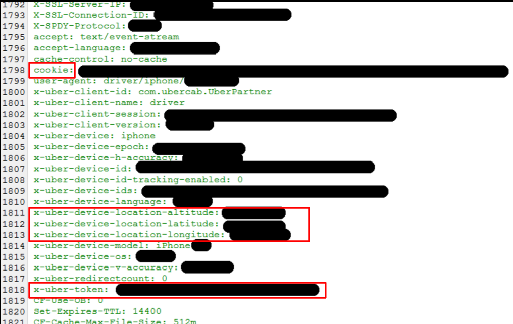

## Abstract
Cloudflare is a company that provides a CDN, DNS, and security services for customer's websites. Cloudflare acts as a reverse proxy, sitting between customers' sites and their visitors in order to add security features and improve performance. Early in 2017, a bug in Cloudflare's services was found to be leaking sensitive memory from Cloudflare's servers into some HTML responses. This bug, similar to its namesake- the 2014 Heartbleed bug in TLS/SSL, could leak whatever data was present in memory at the time: internal headers, cookies, HTML POST bodies, and even passwords. This was exacerbated by search engines caching the leaked data- making it more public and more easily accessible. Cloudflare responded to the bug quickly and deployed a kill switch for the source of the bug (its HTML parser) within 8 hours of it being reported. Cloudflare also insists that there is no evidence suggesting the bug was exploited in the wild. However, the potential severity of the bug is difficult to overstate. Cloudflare's reverse proxy created a single point of failure- effectively making secure encryption schemes like SSL/TLS, authentication, and other modern security efforts pointless. In this post we will be discussing Cloudbleed's coverage in the media, the problem in Cloudflare's HTML parser that lead to memory being leaked, and what the security community can learn from this experience going forward.

## Discovery, Incentives, and Involved Parties

## Media Coverage

## The Bug
##### Effects of the Bug
That is how the bug works, but how did it look on the browser? This is an example of how it looked like:

 

As we can see the bug directly injected data into the html file. Sometimes it injected **sensitive** data in plaintext into the website.

Here is an example of Uber data that you could search for using google. You only need to search with the Cloudflare header followed by the company name.

On the Image above we can see the potential data leaks from Uber including a specific user’s cookie, exact geolocation and the Uber auth token. The Uber auth token and cookie is particurlary sensitive because it can be used to steal a User's session.

The Search Results where quickly scrubbed by Google, Duck Duck Go and other major search engines after the initial discovery. This was done to prevent exposure of sensitive information.

## Prevention and Takeaways

###### Cloudflare was the Single point of Failure

So what happened to all the modern security standards we learned in class and why didn’t they protect our privacy? None of the Security standards including TLS/SSL were compromised or misused, No Encryption scheme was broken. The bug was caused by poorly written code on Cloudflare’s server itself and it was leaking raw sensitive memory data into html pages. This situation was made worse because Google and other search engines cached that data that allowed the data to be easily searched.

* Tagged Memory - Companies could use tag memory so it becomes harder to actually access the memory if an overflow like this happened.

* Sand Box their servers - would prevent this since accessing a site with malformed html will only give you access of that's site data and not other sites, making the impact minimal since a few sites using Cloudflare actually have this problem.

* Evaluate legacy code thoroughly **AUSTIN**

## Legal and Ethical Issues

## Acknowledgment
Thanks to Professor Goldberg and Ann Ming Samborski for all the feedbacks.

## References
* https://blog.cloudflare.com/incident-report-on-memory-leak-caused-by-cloudflare-parser-bug/

* http://gizmodo.com/everything-you-need-to-know-about-cloudbleed-the-lates-1792710616

* http://homes.cs.washington.edu/~dcjones/biojl/parsing.html
* https://github.com/calio/ragel-cheat-sheet
* http://thingsaaronmade.com/blog/a-simple-intro-to-writing-a-lexer-with-ragel.html
* http://www.evanmiller.org/nginx-modules-guide-advanced.html#parsing
* https://bugs.chromium.org/p/project-zero/issues/detail?id=1139
* https://blog.cloudflare.com/quantifying-the-impact-of-cloudbleed/
* https://devhub.io/repos/mtourne-jitify-core
* https://techcrunch.com/2017/03/01/cloudbleed-investigation-turns-up-a-million-leaks-but-no-signs-of-exploitation/
* http://www.bankinfosecurity.com/blogs/cloudflares-cloudbleed-small-risk-but-data-still-floating-p-2407
* http://www.huffingtonpost.ca/2017/02/24/cloudbleed-bug-passwords-compromised_n_14989650.html
* https://support.cloudflare.com/hc/en-us/articles/205177068-Step-1-How-does-Cloudflare-work-
* https://blog.sqreen.io/anatomy-of-cloudflare-cloudbleed-what-you-need-to-know-and-fix/
* https://support.cloudflare.com/hc/en-us/articles/205177068-Step-1-How-does-Cloudflare-work-
* https://www.google.com/url?sa=i&rct=j&q=&esrc=s&source=images&cd=&cad=rja&uact=8&ved=0ahUKEwjJpai-2YbTAhUCKiYKHdePCcoQjhwIBQ&url=https%3A%2F%2Fblog.sqreen.io%2Fanatomy-of-cloudflare-cloudbleed-what-you-need-to-know-and-fix%2F&bvm=bv.151325232,d.amc&psig=AFQjCNHnzPmtrKeb_HVSscmayD5AkToa1Q&ust=1491254345625079
* http://www.spamfighter.com/News-20773-Security-Hack-Cloudbleed-takes-Prominence.htm
* https://xkcd.com/1353/
